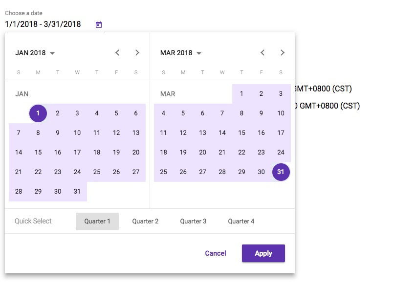

# Material range datepicker
Material datepicker with range support
## What is this?

This is a based on Material source code (March 22, 2018) implementation of Material Datepicker for Angular.
I created this repository and this package due to it takes a lot of time to contribute to material2 repository.
[Issue in material2 repo.](https://github.com/angular/material2/issues/4763)

## [DEMO](https://stackblitz.com/edit/angular-b23dak)
## Advantages
1) Dates range selecting in datepicker 
2) Have special attribute to turn on range mode on datepicker
3) Value managing as easy as it in `MatDatepicker`
4) *You can use all attributes: min, max, formControl and others*
5) Supports input from keyboard
6) Supports keyboard handling
 
## It's awesome, but how to use it?

As easy as pie.
Installation: `yarn add mat-range-datepicker` or `npm install mat-range-datepicker`
Import `MatRangeDatepickerModule`, `MatRangeNativeDateModule` and `MatDatepickerModule`
```angular2html
  <mat-form-field>
    <input matInput [matRangeDatepicker]="resultPicker">
    <mat-range-datepicker
        #resultPicker
        [rangeMode]="true">
    </mat-range-datepicker>
   </mat-form-field>
```

Add styles:
* If you are using CSS: copy-paste or include somehow the file `mat-range-datepicker/bundle.css`
* If you are using SCSS: 
```scss
@import '~mat-range-datepicker/theming';
@include mat-range-datepicker-theme($theme); # material theme data structure https://material.angular.io/guide/theming#defining-a-custom-theme
```

## ngModel/formControl value have this interface:
```typescript
export interface matRangeDatepickerRangeValue<D> {
  begin: D | null;
  end: D | null;
}
```

Licence: MIT

# to dev
npm start

## to deploy 
yarn build:lib
cd dist
npm version patch
npm pack
npm publish
